# src/module_patches/

In order to capture database queries and to correctly associate database processing with the request that caused the query, we have to patch third party modules.

This patching is achieved by using the [require-in-the-middle](https://github.com/elastic/require-in-the-middle/) library, which allows us to hook into Node's internal require system.

This is a relatively fragile approach, so we use tooling to mitigate the risk of breakages due to patched internals as much as possible. For more information, see the sections on testing in the [architecture documentation](https://quip.com/9rUbASnSk29u/Profiler-Architecture) and in the  [DEVELOPING documentation](/DEVELOPING.md).

## Patches

### http_outgoing.ts

The `http_outgoing` patch wraps around Node's stdlib http/s clients to capture outgoing request information and send it to the agent via `CT_HTTP_OUTGOING_INFORMATION`.

### mssql.ts

The `mssql` patch is quite straightfoward, patching the `_query` and `_execute` methods of the `Request` class. In an ideal world we would patch only the public interface, but unfortunately to avoid issues with `mssql` submodules holding references to unpatched classes, we need to apply the patch to the internal module itself.

The `mssql` internals are fairly stable. We currently support v4 and upwards, which is the last three years of releases as of the start of 2020.

### mysql.ts

The `mysql` patch is somewhat complex. `mysql` is the older MySQL adapter in common usage, and the internals reflect that. While the patch code is fairly short, it's quite delicate.

We patch the internal `Query` class. It's trivial to wrap the class so that we can capture the details of the query, but the bigger problem is the design of how the adapter processes queries.

When the results of a query are returned to the adapter, they're executed by default in an async context that's unrelated to our query's async context. This means that any activity that occurs as a result of query processing (including callbacks into our application code) is not associated with the trace.

To fix this, we use the `wrapType` helper from our `async` module to wrap all of the methods that handle processing a query's result in an asynchronous context that's associated with our request.

While this may appear to be a fragile approach, the `mysql` internals and file structure have remained largely unchanged since early versions. As such, we support every version onwards from `v2.1.1`, which was released in March 2014.

### mysql2.ts

`mysql2` is a more modern take on a MySQL adapter, which simplifies the patching process. As with the `mysql` adapter we need to wrap the logic for query handling in an asynchronous context that's associated with our query.

The `mysql2` internals have so far been largely stable since release, allowing us to support every version from `v1` onwards with a single patch.

### pg.ts

The `pg` patch largely mirrors the design of the MySQL adapters. We wrap the methods of the `Query` class responsible for handling responses from the database in an asynchronous context so that any processing shows up in the trace.

Rather than recording the query details by wrapping an internal class, we replace the core `query` public API method directly on the exports.

`pg` is a stable and established module, and as such the internals tend not to change. We currently support six years of releases with a single patch.

### mongodb.ts

The `mongodb` patch is quite complex, touching a variety of modules in relatively intricate ways.

In order to provide asynchronous context tracking, we have to wrap around a few pieces of Mongo's internals.

The first step was to wrap processing of `executeOperation`, so that when a result is passed back to our program we detect that callstack.

The bulk of Mongo's processing for queries is in parsing, and unfortunately parsing is not done inside of an object that we can attach an async resource to. Instead, we use Mongo's built in `instrument` method to keep async resources for each operation, which we can then use to run the parsing phase in the correct async scope. This means parsing shows up in our request callstacks.

The final part is the infrastructure for sending `CT_SQL_INFORMATION`. Unlike SQL databases, mongo doesn't send commands as text over the wire, instead preferring to have a tightly coupled adapter that progressively makes queries as the results are interated over.

To build queries, a user starts with a collection object, and then calls a method like `find`. This returns a cursor, which is the interface actually used for querying the database.

There are a number of ways one can configure and consume a cursor. Notably, cursors support chaining methods like `.sort` and grouping methods to build up a query.

To ensure we have access to these cursors, we wrap the methods on a collection that construct a cursor.

Since there's no default textual representation of a query, we wrap around the cursor's methods to build up a series of operations that we can send as text later on.

We also wrap the cursor's state processing method to get a reliable mechanism for determining when queries end that works across v2 and v3.

As of writing, we support four year's worth of mongodb releases.

### redis.ts

This file provides patches for `redis` and `ioredis`. Both of them share the underlying `redis-parser` module.

In order to provide async context tracking for the parsing step, we wrap around the shared parser. However, there is no information directly available inside of the parser to determine which query a request corresponds to.

Instead, we capture a reference to the client that created the parser, and then inspect the command at the front of the work queue to get a related `AsyncResource` that we can use for parsing. This approach works across `ioredis` and `redis`.

For both libraries, we wrap around dispatching a command object, and use that to both record query duration and information, and to attach the async resource that can be used to associated future command work with the original request that caused the query.

We support at least two years worth of releases for both `redis` and `ioredis` presently.

### elastic.ts

This file patches the `@elastic/elasticsearch` module to capture query details and track asynchronous contexts.

This module's design made it easy to implement query capturing, but hard to track all of the work done by the adapter. The client emits `request` and `response` events that are sufficient to track the start and end of a query. We simply attach the start time and async id to the request and refer to it later.

The major stage that this patch doesn't capture is the parsing step. Due to the heavy use of closures inside of the module, it's hard to patch the parser in an appropriate place.

Thankfully, typical Elastic queries, even with a large set of results have a very low parse time.

Since this adapter is quite recently released, we support all versions with a relatively simple patch.

### worker_threads.ts

This file patches the standard library `worker_threads` module to capture profiles inside of workers.

This module is a fairly simple patch that attempts to require the ProfiledWorker class, and replaces `worker_threads.Worker` if possible.

For details on how Workers are profiled, see the README in the `worker_threads` subfolder.

### memcached.ts

This file patches the `memcached` module to capture queries and keep profiles alive while they're running.

This patch is fairly straightforward. We replace the `command` function on the `memcached` prototype, and then wrap the callback for each query.

This provides us with a solid place to intercept queries, and since this library only supports callbacks it's not too trick to manage their lifecycles.

The only real trick here is that we don't have access to the specific server that was used to execute a command. To resolve that, we have an event emitter for `connect` calls, and we listen to that to try to obtain the correct server.

If we can't get that, we fall back to the server that was passed into `command` or none at all.

Memcached doesn't have a concept of separate databases, so we simply send `default` for the database field.

### elasticsearch.ts

This file patches the `@elastic/elasticsearch` to capture queries and keep profiles alive while they're running.

This patch is fairly straightforward, wrapping the default elastic client and adding event listeners for the internal request and response events.

It's worth noting that we investigated patching the legacy `elasticsearch` package but at the time of development it was clear that it wasn't worth investing heavily in patching a package that was soon to be deprecated.

### timers.ts

This file patches the Node global timer functions, `setTimeout` and `setImmediate`, in order to allow timers triggered by the user to extend a profile's lifetime.

This means that if a user calls `setTimeout` inside of a web server request handler, the profile for that request will wait for the timeout to complete before processing.

In order to prevent libaries causing trace timeouts due to using lazily triggered timer loops, we check the caller to see if a given timer was triggered by the user or library code. This is slightly hacky but does the trick.
