## src/module_patches/worker_threads

### profiled_worker.ts

The `profiled_worker.ts` module exports a `makeProfiledWorker` function, that takes in the `Worker` and `MessageChannel` exports of the `worker_threads` module and returns a `ProfiledWorker` class.

The `ProfiledWorker` class extends the `Worker` class to provide profiling functionality without impacting end user behaviour.

In order to profile workers, we import the `v8-profiler-node8` module inside of the worker thread. This means that we need to be able to send messages in and out of the worker to control when the profile is started and stopped, as well as to bring the worker profile data back to the main thread where it can be processed.

There are quite a few different ways in which users can utilise Workers, but here are two of the most common along with how the `ProfiledWorker` handles these cases.

When creating a `ProfiledWorker`, we pass a separate message channel via the `workerData` field that is used for all communication related to APM. This is preferable to using the primary message port as it doesn't impact the user's application.

When a `ProfiledWorker` is created inside of an asynchronous context that is already associated with a profile, we use the `workerData` field on `ProfiledWorker` to pass through a flag indicating that profiling should begin immediately.

When `.terminate()` is called on the worker, the `ProfiledWorker` will first send a message over the APM `MessagePort` to stop the worker profile. Once the profile is stopped, the worker runtime will send the profile back to the main thread, and then the `.terminate()` promise will resolve.

A more realistic and complex example is when the worker is created prior to the main thread profile starting. For example, a web application might create a pool of workers on startup to handle CPU intensive applications. In this case, we want to start profiling a worker when it is utilised by a profiled request on the main thread. To enable this, the `ProfiledWorker` will start profiling a worker when a message is received, and stop profiling either when the worker terminates or when the main thread profile ends.

The `ProfiledWorker` also supports the case where multiple main thread profiles simultaneously submit a job to the worker. While this is unlikely, the `ProfiledWorker` is capable of running many profiles at once, keyed by the async id of the associated main thread profile.

### worker_runtime.ts

This module is loaded by each worker prior to executing any of the user's code. This module uses the APM message port provided by the `ProfiledWorker` class to manage and return worker profiles.

### serialization.ts

Contains simple helpers for serializing and deserialization arbitrary JSON that may contain bigint values. Used to send v8 profiles and worker effects back to the main thread.
